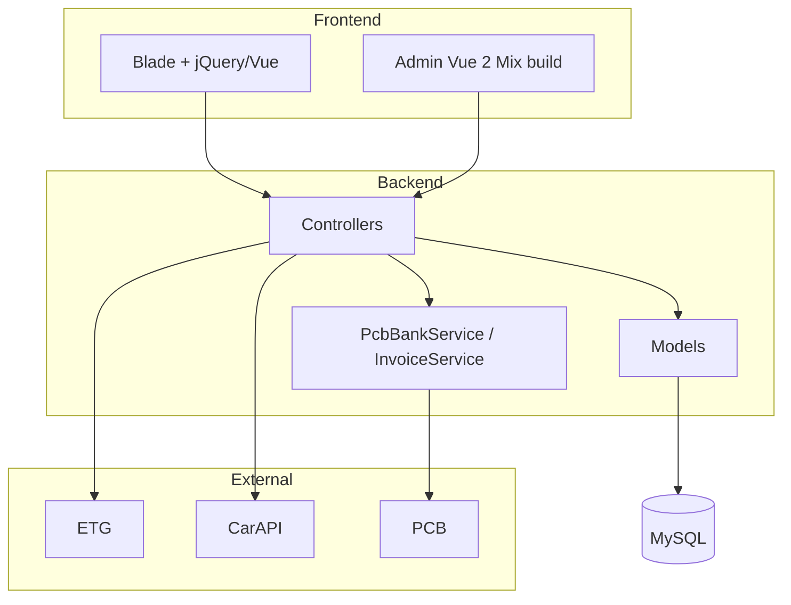

# Project Overview

## Overview

Mjellma is a customized **Booking Core** travel marketplace built on **Laravel 10**. It lets travelers search and book hotels and cars (and other bookable services), while operators manage inventory, bookings, CMS content, users, and payments from an admin panel.

Composer package name remains `laravel/laravel`. Display name defaults to `Booking Core` via `APP_NAME`. Application version: **`3.4.2`** in `config/app.php`. Active theme **BC** reports version **`3.6.0`** in `themes/BC/ThemeProvider.php`.

## Problem It Solves

Travel agencies and marketplace operators need:

- Live hotel rates and booking against a wholesale supplier (ETG / RateHawk / WorldOTA)
- A searchable local hotel catalog for discovery and SEO-friendly detail pages
- Car rental search against a partner API
- Classic on-platform inventory (tours, spaces, events, flights, boats) with vendor tools
- Multi-gateway payments with a primary PCB Bank card flow
- Admin/CMS, multi-language UI, roles/permissions, and a JSON API for clients

## Intended Users

| Audience | Typical access |
| --- | --- |
| Guests / B2C customers | Public hotel/car search, booking, account |
| B2B agents / vendors | Role-based ETG credentials, vendor listing tools |
| Administrators | `/admin` dashboard (prefix configurable) |
| Mobile / API clients | `/api/*` with Sanctum tokens |

## Major System Responsibilities

1. **Hotel product (primary homepage)** — local `hotels` + ETG live rates, prebook, PCB payment, ETG order finish
2. **Car rental** — proxy search/checkout to external car API + PCB/cash
3. **Booking Core services** — tour, space, event, flight, boat CRUD, availability, cart/checkout
4. **Payments** — gateway registry in `config/payment.php`
5. **Identity** — Fortify web auth, custom roles/permissions, Sanctum API tokens
6. **CMS** — pages, news, templates, popups, media, menus, offers
7. **Ops** — reports, logs, settings, scheduled plan expiry

## Main Modules

Registered from `Themes\Base\ThemeProvider::$modules` (plus `Modules\Offers\ModuleProvider` in `config/app.php`):

Core, Api, Booking, Hotel, Space, Car, Event, Tour, Flight, Boat, Contact, Dashboard, Email, Sms, Language, Media, News, Page, User, Template, Report, Vendor, Coupon, Location, Review, Popup, Offers, Theme.

## Product Customizations vs Stock Booking Core

| Stock Booking Core | This implementation |
| --- | --- |
| Homepage `HomeController@index` | Commented out; `/` → `HotelHController@showHotels` |
| Public hotel search on `bravo_hotels` | Classic routes commented; ETG + `hotels` table drive public UX |
| Vendor “Manage Hotel” prominence | Partially disabled in hotel menus |
| Generic checkout only | HA hotel flow uses dedicated confirmation/PCB routes |

## High-Level Request Lifecycle

```text
HTTP Request
    → public_html/index.php
    → Global middleware (installer redirect, CORS, …)
    → web/api middleware group
    → Route (routes/* or modules/*/Routes)
    → Controller
    → Models / Services / External HTTP
    → Blade view or JSON response
```

## How Major Parts Communicate



## Related Documentation

- [Technology Stack](./02-technology-stack.md)
- [Project Architecture](./03-project-architecture.md)
- [Features](./13-features.md)
- [Integrations](./17-integrations.md)
