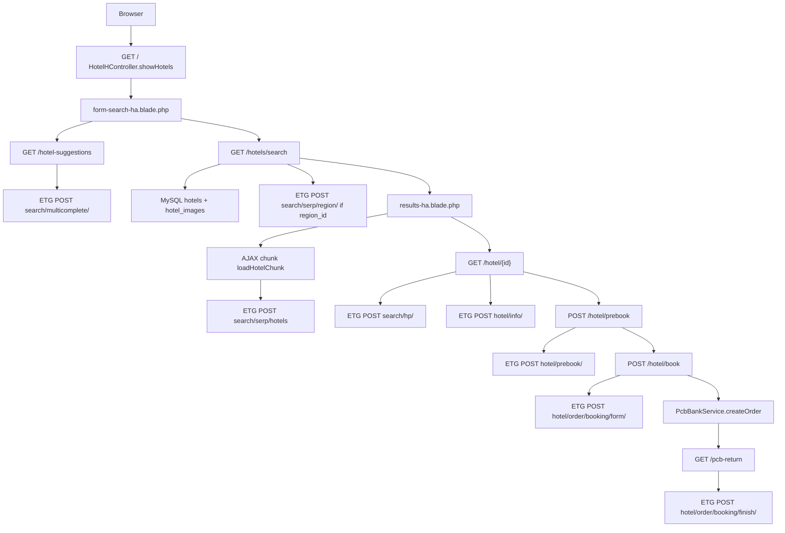

# Architecture

This application is a **modular Laravel monolith**. There is no separate Node/Python application server. Python scripts are offline importers.

Related: [Project Structure](./02-PROJECT-STRUCTURE.md) · [Backend](./09-BACKEND.md) · [Frontend](./08-FRONTEND.md) · [Hotel Search](./21-HOTEL-SEARCH.md)

---

## Layers

```
┌─────────────────────────────────────────────────────────┐
│  Browser (Blade pages, jQuery, some Vue 2 in admin)     │
└───────────────────────────┬─────────────────────────────┘
                            │ HTTP
┌───────────────────────────▼─────────────────────────────┐
│  public_html/index.php  (document root)                 │
│  HTTP Kernel + middleware (installer, session, CSRF,    │
│  locale, currency, dashboard, RequireChangePassword)    │
└───────────────────────────┬─────────────────────────────┘
                            │
┌───────────────────────────▼─────────────────────────────┐
│  Routing                                                │
│  routes/web.php + each Modules\*\RouterServiceProvider  │
└───────────────────────────┬─────────────────────────────┘
                            │
┌───────────────────────────▼─────────────────────────────┐
│  Controllers                                            │
│  App\Http\Controllers  |  Modules\*\Controllers         │
│  Modules\*\Admin       |  Custom\CarRent\Admin          │
└─────────────┬───────────────────────────┬───────────────┘
              │                           │
              ▼                           ▼
     Eloquent / Query Builder      Laravel HTTP client
     MySQL (bravo_*, hotels,       ETG WorldOTA B2B API
     mjellma_bookings, …)          Car API (CAR_API_BASE)
                                   PCB Bank (mTLS)
└─────────────┬───────────────────────────┬───────────────┘
              │                           │
              ▼                           ▼
     Blade views + Mix assets      Session (prebook, search)
```

---

## Request flow (generic)

1. `public_html/index.php` loads Composer autoload, optional `storage/bc.php` / `storage/pro.php`, creates the app, binds `path.public` to `public_html`.
2. `App\Http\Middleware\RedirectToInstaller` redirects to `/install` unless `storage/installed` exists.
3. `web` middleware group: cookies, session, CSRF, `RedirectForMultiLanguage`, debugbar hide, `SetCurrentCurrency`, `SetLanguageForAdmin`, `RequireChangePassword`.
4. Matching route in root `routes/web.php` or a module `Routes/web.php` (and locale-prefixed `language.php` copies).
5. Controller method → services / models / `Http::` → Blade or JSON.

Admin routes typically use middleware `['web','dashboard']` and prefix `config('admin.admin_route_prefix')` (`admin` by default) plus `/module/{name}` for most modules. Dashboard home is `{prefix}/` → `Modules\Dashboard\Admin\DashboardController@index`.

---

## Frontend / backend relationship

This is **server-rendered**. Blade templates call named Laravel routes. Hotel search results load extra chunks with AJAX (`searchHotels` when `ajax` + `chunk` is present). Admin settings forms use Vue 2 compiled by Mix.

The `/api` JSON API (`modules/Api`) is a parallel surface for mobile/SPA clients (Sanctum tokens). It is **not** what the Blade hotel search uses.

---

## Hotel search request flow



Full narrative: [Hotel Search](./21-HOTEL-SEARCH.md).

---

## Car rental flow (summary)

`Modules\Car\Controllers\CarController` reads `CAR_API_BASE` / `CAR_API_TOKEN` / `CAR_API_REFERER`, calls paths such as `company-locations`, `reservations`, `checkout`, `store-checkout`. PCB return: `GET /car/pcb/return`. Details: [Car Rental](./22-CAR-RENTAL.md).

---

## Booking Core service layer

Bookable types implement `Modules\Booking\Models\Bookable`. Checkout for **legacy** services uses:

`POST /booking/addToCart` → `BookingController@addToCart` → session cart → `GET /booking/{code}/checkout` → `doCheckout` → gateway class in `config/payment.php`.

ETG hotel bookings use `mjellma_bookings` and `HotelHController`, not that cart, for the HA flow.

---

## Data access

| Store | Used for |
|---|---|
| `core_settings` | Runtime config via `setting_item()` / `Modules\Core\Models\Settings` |
| `users` + `user_meta` | Accounts; `user_type` meta for B2B/B2C ETG credentials |
| `bravo_hotels` / rooms | Legacy hotel inventory |
| `hotels` / `hotel_images` | ETG static dump |
| `mjellma_bookings` | ETG hotel orders + PCB status |
| `bravo_bookings` / `bravo_booking_payments` | Booking Core bookings |
| `invoices` | PCB invoice rows (`database/migrations/2025_09_26_000000_create_invoices_table.php`) |
| File cache | ETG region hotel IDs, search params (`Cache::`) |

`AppServiceProvider::initConfigFromDB` overlays mail, Pusher, filesystem from settings after install.

---

## Authentication architecture

- Web: Fortify (`login` view `auth.login`) + `LoginController` social OAuth.
- User must have `status == publish` (`FortifyServiceProvider::authenticateUsing`).
- API: Sanctum personal access tokens (`AuthController@login` requires `device_name`).
- Roles/permissions: `Modules\User\Traits\HasRoles` and `PermissionHelper`.
- Admin gate: middleware alias `dashboard` → `App\Http\Middleware\Dashboard`.

See [Authentication](./12-AUTHENTICATION.md).

---

## Background processing

| Mechanism | What |
|---|---|
| `QUEUE_CONNECTION=sync` (example env) | Jobs run inline |
| `schedule()->command(ScanUserPlanExpiredCommand::class)->daily()` | Deactivates services when vendor plans expire |
| No queue workers are defined in source | Start `php artisan queue:work` only if you change the connection |

---

## Shared modules and providers

Registered in `config/app.php` `providers`:

- `Themes\ThemeServiceProvider`
- `Modules\ServiceProvider` (loads Theme module provider, which registers theme modules)
- `Plugins\ServiceProvider`
- `Custom\ServiceProvider`
- `Pro\ServiceProvider`
- `Modules\Offers\ModuleProvider` (also registered explicitly)
- `App\Providers\AdminRouteServiceProvider` (loads commented `routes/admin.php`)

`Modules\ServiceProvider::getActivatedModules()` uses `ThemeManager::currentProvider()::getModules()`.

---

## Important dependency directions

- `HotelHController` depends on env `API_*`, tables `hotels` / `hotel_images` / `mjellma_bookings`, `PcbBankService`, `BookingConfirmationEmail`.
- `CarController` depends on `CAR_API_*` env and PCB for paid checkout.
- Gateways in `config/payment.php` are resolved by Booking Core checkout.
- Views: module namespace `Hotel::frontend.*` resolved through theme view locations (`themes/BC` first).
