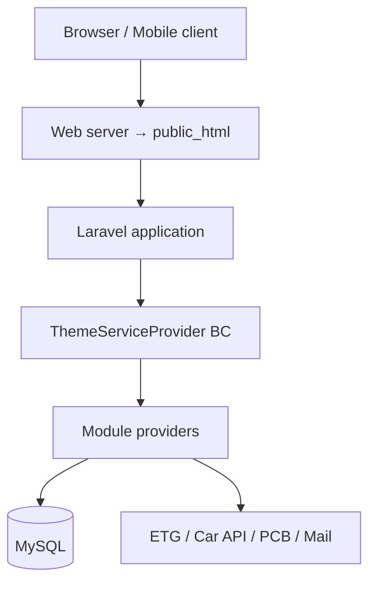

# Project Architecture

## Overview

Mjellma is a modular Laravel monolith. Domain features live under `modules/`, presentation overrides under `themes/`, and shared application services under `app/`. The HTTP document root is `public_html/` (not `public/`).

## System Architecture



## Provider Bootstrap

Order of interest in `config/app.php`:

1. Framework providers
2. `Themes\ThemeServiceProvider` — loads active theme (`BC`)
3. `Modules\ServiceProvider` — scans module views
4. `Plugins\ServiceProvider` — e.g. TwoCheckout plugin
5. `Custom\ServiceProvider`
6. `Pro\ServiceProvider`
7. Fortify + App providers
8. `Modules\Offers\ModuleProvider` (explicitly listed)

`Themes\BC\ThemeProvider` extends `Themes\Base\ThemeProvider`, which registers every class in `static::$modules`.

## Frontend Architecture

- **Server-rendered Blade** for public site and most admin screens
- **Theme override chain:** `modules/{Module}/Views` → `themes/Base/...` → `themes/BC/...` (BC wins for same namespace)
- **Admin Vue 2** compiled by Mix into `public_html/dist/admin`
- **Frontend Sass** compiled by Mix into `public_html/dist/frontend`
- Classic service search uses jQuery AJAX (`public_html/js/filter.js`)
- Hotel HA (ETG) UI is largely Blade + inline/`fetch` + Leaflet

## Backend Architecture

Typical web request:

```text
Route → Middleware → Controller → Validation → Eloquent / Service / HTTP client → Response
```

Layers in practice:

| Layer | Location |
| --- | --- |
| Routes | `routes/*.php`, `modules/*/Routes` |
| Controllers | `app/Http/Controllers`, `modules/*/Controllers`, `modules/*/Admin` |
| Models | `app/User.php`, `modules/*/Models` |
| Services | `app/Services/*`, gateway classes |
| Policies / permissions | `modules/User` helpers + policies |
| Events / listeners | `app/Providers/EventServiceProvider`, module providers |
| Gateways | `modules/Booking/Gateways` |

There is **no** dedicated repository layer; Eloquent models are used directly.

## Database Layer

- Laravel migrations under `database/migrations`, `themes/Base/Database/Migrations`, and `modules/*/Migrations` (and Offers)
- ETG static hotel catalog tables `hotels` / `hotel_images` are created/populated by **Python** (`hotels_data.py`), not Laravel seeders
- Booking records: classic `bravo_bookings` + ETG-oriented `mjellma_bookings`

## Authentication Layer

- **Web:** session guard `web`, Fortify
- **API:** Sanctum personal access tokens
- **Social:** Socialite routes in `routes/web.php`
- Only users with `status == publish` authenticate (Fortify custom callback)

## Authorization Layer

- Custom role system (`core_roles`, `core_role_permissions`) via `HasRoles` trait — **not** Spatie
- Permission helper + `config/permissions.php`
- Middleware `dashboard` gates admin UI
- Module policies under `modules/User/Policies`

## Integrations Layer

| Integration | Direction | Notes |
| --- | --- | --- |
| ETG | Outbound Basic Auth HTTP | IPv4 forced in hotel controller |
| Car API | Outbound token HTTP | Cached metadata lists |
| PCB Bank | Outbound mTLS + user HPP redirect | Cert files under `storage/certs/` by default |
| Mail | Outbound | Laravel mailers |
| Cloud storage | Optional | S3 / GCS packages present |

## Storage

- Default disk `local`; uploads under `public_html/uploads` patterns used by Media module
- PCB TLS materials expected at configured cert paths (never commit private keys)

## Notifications & Background Work

- Email/SMS listeners on booking and user events
- Queue default `sync` — listeners run inline unless queue driver changes
- Scheduler: daily `user_plan:expired` (`app/Console/Kernel.php`)
- No application `Job` classes under `app/` or `modules/` for domain work

## Caching

- Laravel cache driver (file by default)
- Car API metadata cached ~1 hour in `CarController`
- Settings/helpers may use cache via AppHelper patterns

## Related Documentation

- [Project Structure](./04-project-structure.md)
- [Backend](./08-backend.md)
- [Frontend](./09-frontend.md)
- [Database](./07-database.md)
