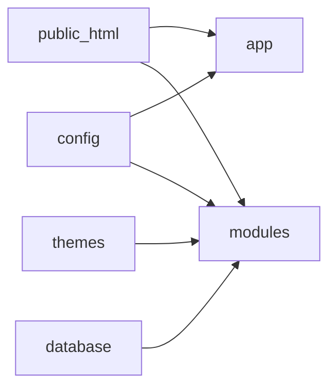

# Project Structure

## Overview

Repository layout for project-owned source (vendor/node_modules omitted from detail).

```text
mjellma/
├── app/                 # Application core (HTTP, User, Services, Console, Providers)
├── bootstrap/           # Laravel bootstrap
├── config/              # Configuration PHP files
├── custom/              # Custom namespace extension point (Custom\)
├── database/            # Migrations, seeders, factories
├── docs/                # This documentation
├── lang/                # Root translation files (en, sq, …)
├── modules/             # Domain modules (Modules\)
├── plugins/             # Optional plugins (Plugins\) — e.g. PaymentTwoCheckout
├── pro/                 # Pro add-on (Pro\)
├── public/              # Minimal stub (uploads); NOT the web root
├── public_html/         # Web document root (index.php, assets, dist, themes mix sources)
├── resources/           # Shared views aliases, lang, ckeditor samples, etc.
├── routes/              # Top-level web/api/admin/console/channels routes
├── storage/             # Logs, cache, sessions, installed flag, certs
├── tests/               # PHPUnit tests
├── themes/              # Base + BC theme providers and view overrides
├── artisan              # CLI entry
├── composer.json
├── package.json
├── hotels_data.py       # ETG hotel dump importer
├── meal_data.py         # Meal type importer
└── .env.example
```

## Important Folders

### `app/`

Laravel application code: middleware, providers, `User` model, Fortify wiring, PCB/Invoice services, console commands, helpers (`AppHelper.php`, `ProHelper.php` autoloaded).

### `modules/`

Primary business domains. Each module typically contains `ModuleProvider.php`, `Routes/`, `Controllers/`, `Models/`, `Views/`, `Admin/`, migrations, and config.

### `themes/`

- `Base/` — module registration list + default migrations/views
- `BC/` — active product theme overrides (Hotel HA views, Layout, Car, Booking, …)

### `public_html/`

Must be the web server document root. Contains front controller, compiled `dist/`, libraries, module static JS/CSS, theme Mix projects under `themes/admin` and `themes/bc`.

### `config/`

Includes Laravel defaults plus Booking Core domain configs (`hotel.php`, `booking.php`, `payment.php`, `pcb_bank.php`, `bc.php`, `permissions.php`, …).

### `database/`

Project-level migrations (including `mjellma_bookings`, invoices, PCB columns) and seeders. Theme/module migrations load via providers.

### `pro/`

Optional Pro features (`PRO_ENABLE`), AI/Support/Booking namespaces, `pro_plan` middleware.

### `plugins/`

Third-party style plugins (TwoCheckout payment).

### `lang/` / `resources/lang/`

Localization strings (English and Albanian present).

### Python scripts (root)

`hotels_data.py` and `meal_data.py` maintain ETG static data. Not required to boot the PHP site, but required for a populated hotel catalog.

## How Folders Relate



## Related Documentation

- [Backend](./08-backend.md)
- [Frontend](./09-frontend.md)
- [Important Files](./reference/important-files.md)
