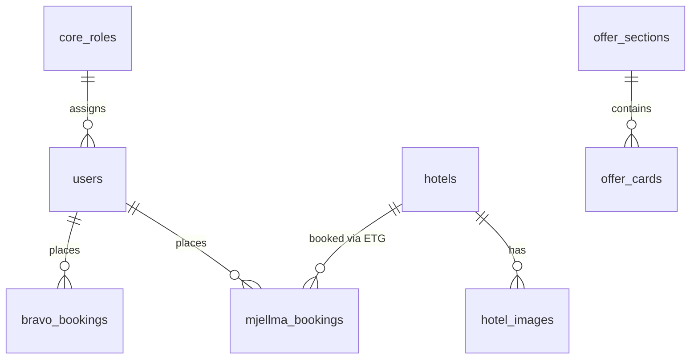

# Database

## Overview

Default connection is **MySQL**. Schema comes from:

1. `database/migrations`
2. `themes/Base/Database/Migrations` (loaded by Base theme)
3. Module migrations (including Offers)
4. Python scripts that `CREATE TABLE IF NOT EXISTS` for ETG static hotel data

Never document real customer rows. Use [Database Tables](./reference/database-tables.md) for table-level detail.

## Migration Sources

| Source | Examples |
| --- | --- |
| `database/migrations` | `mjellma_bookings`, `invoices`, PCB columns on bookings, Sanctum tokens, news, booking payment meta |
| `themes/Base/Database/Migrations` | Core Booking Core tables such as `bravo_bookings` |
| `modules/*/Migrations` | Per-domain tables (hotels Bravo, roles, offers, …) |

## Core Domains

### Users & roles

- `users` and related profile/meta tables
- `core_roles`, `core_role_permissions`

### ETG hotel catalog (static)

- `hotels` — model `HotelH`
- `hotel_images` — model `HotelImage`
- Populated by `hotels_data.py`

### Legacy / vendor hotels

- `bravo_hotels` and room/availability/term tables — model `Hotel` and related

### Bookings

- `bravo_bookings` — classic Booking Core bookings
- `mjellma_bookings` — ETG hotel booking records (`MjellmaBooking`)
- PCB-related columns added by 2025-09 migrations
- `invoices` — invoice records via `InvoiceService`

### Offers CMS

- `offer_sections`, `offer_cards`

### Other bookables

Tour, space, car, event, flight, boat tables follow Booking Core `bravo_*` naming under module/theme migrations.

## Entity Relationship (simplified)

## Seeders

`database/seeders/DatabaseSeeder.php` delegates to theme seeders when available, otherwise demo roles/users/media/locations/services.

## Indexes & Constraints

Indexes are defined in individual migrations. Treat migration files as source of truth when altering schema.

## Working With Schema Changes

1. Add a migration under the appropriate owner (`database/` or module)
2. Run `php artisan migrate`
3. Update models and docs in `reference/database-tables.md`

## Related Documentation

- [Database Tables](./reference/database-tables.md)
- [Models](./reference/models.md)
- [Business Logic](./12-business-logic.md)
