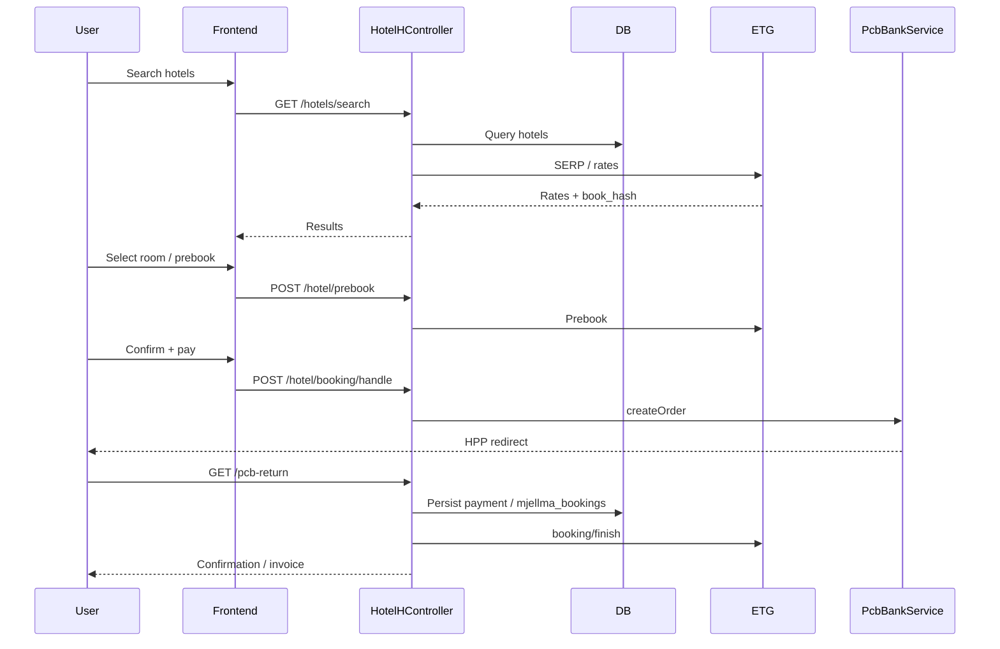
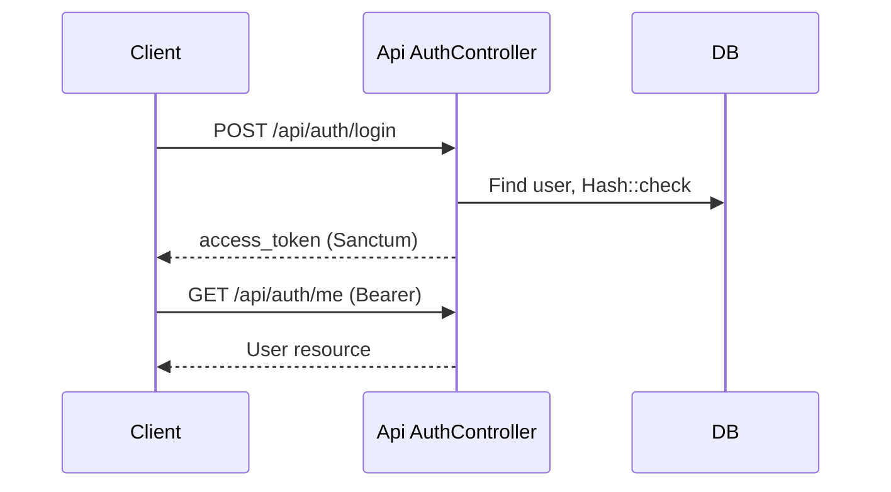

# Workflows

## Overview

End-to-end flows for the customized hotel booking path, car rental, classic checkout, and API login.

## Hotel Search → PCB → ETG Finish



### Step list

1. `GET /` → `showHotels` → `form-search-ha`
2. Search → `searchHotels` / map / suggestions
3. `GET /hotel/{id}` → live rates
4. `POST /hotel/prebook` → prebook result view
5. `POST /hotel/book` → confirmation with `book_hash`
6. `POST /hotel/booking/handle` → PCB order when required
7. Bank HPP → `/pcb-return` → `/hotel/payment/confirm`
8. `finishBooking` / `completeBooking` → ETG finalize
9. Success or failed views

## Car Rental Checkout

```text
User Action (search)
    ↓
CarController (API lists + reservations)
    ↓
Detail / checkout form
    ↓
storeCheckout (pcb_bank | cash)
    ↓
PCB HPP (if card) → pcb return route
    ↓
completeCarBookingAfterPayment + email
    ↓
UI confirmation
```

## Classic Booking Checkout

```text
Service detail → addToCart
    ↓
Booking checkout Blade + checkout.js
    ↓
Gateway process (PayPal/Stripe/PCB/…)
    ↓
/gateway confirm|cancel callbacks
    ↓
bravo_bookings status update + emails
```

## API Authentication



## Admin Content Publish

```text
Admin login (auth + dashboard)
    ↓
Module Admin controller
    ↓
Validate + authorize permission
    ↓
Eloquent save
    ↓
Theme frontend reads published content
```

## Related Documentation

- [Business Logic](./12-business-logic.md)
- [Integrations](./17-integrations.md)
- [Routes](./reference/routes.md)
