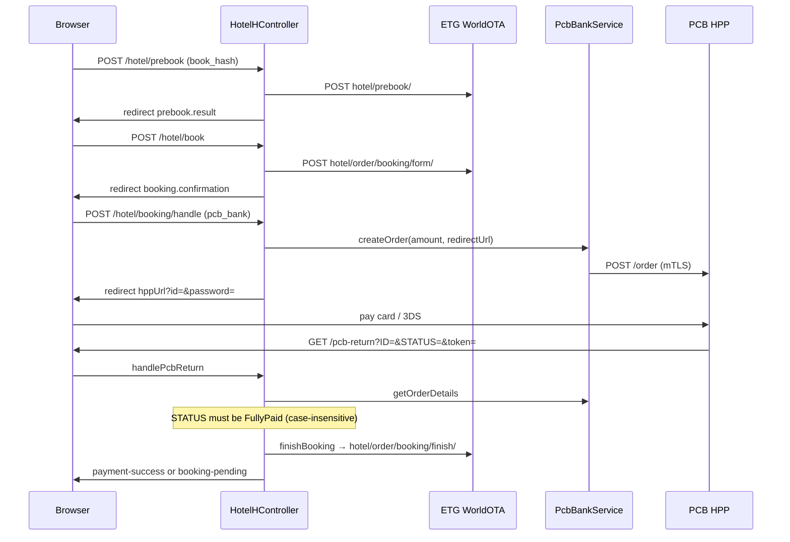

# PCB Bank hotel payment — step by step

This is the **live hotel HA path** (PCB + ETG finish). RateHawk “now + card” and deposit options are commented out in `booking-confirmation-ha.blade.php` / `handleBookingSubmission`. Only `payment_type.type === pcb_bank` (or legacy `now` + card flag) starts PCB.

**Screenshots:** the hosted payment page is **PCB/Quipu**, not this repo. No HPP screenshots are stored here. Each in-app screen is a Blade file you can open in the browser after a real booking.

Related: [Payments](./23-PAYMENTS.md) · [Hotel Search](./21-HOTEL-SEARCH.md) · [B2B/B2C credentials](./28-B2B-B2C-CREDENTIALS.md)

---

## Screens (in-app)

| Step | What the user sees | Blade / URL |
|---|---|---|
| 1 | Search form | `themes/BC/Hotel/Views/frontend/form-search-ha.blade.php` — `GET /` |
| 2 | Results | `results-ha.blade.php` — `GET /hotels/search` |
| 3 | Hotel + rates | `info-ha.blade.php` — `GET /hotel/{id}` |
| 4 | Prebook summary | `prebook-result-ha.blade.php` — `GET /hotel/prebook/result` |
| 5 | Guest form + PCB radio | `booking-confirmation-ha.blade.php` — `GET /hotel/booking/confirmation/{book_hash}` |
| 6 | Bank / 3DS page | External `hppUrl` from PCB `createOrder` (not in this codebase) |
| 7 | Return processing | `handlePcbReturn` then `finishBooking` (may flash pending/success) |
| 8a | Success | `payment-success.blade.php` — `GET /hotel/payment/success` |
| 8b | Pending | `booking-pending.blade.php` |
| 8c | Failed | `booking-failed.blade.php` |

To capture screenshots locally: walk the flow on `{APP_URL}` with test PCB certs; do **not** commit card data or live HPP HTML.

---

## Sequence

---

## Step 1 — Prebook

**Request:** `POST /hotel/prebook` (`hotel.prebook`)

**Handler:** `HotelHController@prebookRoom`

**Body:** `book_hash`, `room_name`, optional children, `price_increase_percent` (default 20), display price fields.

**ETG:** `POST {API_URL}hotel/prebook/` with `hash`, `price_increase_percent`.

**Session:** `prebookData`, occupancy, `display_final_price`, `display_currency`.

**Next:** `GET /hotel/prebook/result`

---

## Step 2 — Create ETG booking form

**Request:** `POST /hotel/book` (`hotel.book`)

**Handler:** `bookRoom`

**Validated:** `book_hash`, `partner_order_id`, `user_ip`, `hotel_id`, `checkin`, `checkout`, optional `meal_plan`.

**ETG:** `POST hotel/order/booking/form/` with `partner_order_id`, `book_hash`, `language=en`, `user_ip`.

**If `status === ok`:** session `bookingData` (includes `payment_types`, taxes not included by supplier). Redirect `hotel.booking.confirmation`.

**Errors:** `double_booking_form`, `sandbox_restriction` → `hotel.booking.failed`. `unknown`/`timeout`/HTTP 5xx → poll `hotel/order/booking/finish/status/`.

Display amount on confirmation uses session `display_final_price` (B2B vs B2C credentials), not necessarily the first ETG `payment_types[0].amount`.

---

## Step 3 — User submits confirmation (PCB)

**View:** `booking-confirmation-ha.blade.php`

**Form:** `POST /hotel/booking/handle` (`hotel.booking.handle`), CSRF.

JS sets hidden `payment_type[type]` to `pcb_bank` when the PCB radio is selected (`data-type="pcb_bank"`).

**Handler:** `handleBookingSubmission`

Conditions to start PCB:

- `payment_type.type === 'pcb_bank'`, **or**
- `type === 'now'` **and** `is_need_credit_card_data` is true

Otherwise: error “Only PCB Bank payment is supported” and stay on confirmation if `book_hash` is present.

**Amount sent to PCB:** `display_final_price` if set, else `payment_type.amount`. Description: `Hotel Booking Pre-Payment`.

**Redirect URL:** `route('pcb.booking.return', ['token' => $token])` → `/pcb-return?token=...`

**Session:**

- `pending_booking_{token}` = full request payload
- `pcb_order_{token}` = `{ id, password }` from PCB

**Redirect:** `{hppUrl}?id={order.id}&password={order.password}`

If `createOrder` fails: back to confirmation with “Failed to redirect to PCB Bank.”

---

## Step 4 — PCB `createOrder`

**Class:** `App\Services\PcbBankService::createOrder`

**HTTP:** mTLS `POST {PCB_BANK_API_URL}/order`

**Payload (source):** `order.typeRid` `"225"`, amount, currency (`PCB_BANK_DEFAULT_CURRENCY` / EUR), description, language, `hppRedirectUrl`, browser device block from the current Laravel request.

Needs certs: `PCB_BANK_CERT_PATH`, `KEY`, `CA` (defaults under `storage/certs/`).

---

## Step 5 — Bank page (external)

User pays on PCB HPP. Query params on return are implemented as:

- `ID` — PCB order id
- `STATUS` — e.g. `FullyPaid`
- `token` — session key

---

## Step 6 — `/pcb-return`

**Handler:** `handlePcbReturn` (`pcb.booking.return`)

1. Load `pending_booking_{token}` and `pcb_order_{token}`. Missing → `/hotels/search` “Session expired”.
2. `strtolower(STATUS) !== 'fullypaid'` → search page “Payment was not successful.” (Unlike `confirmAfterPcb`, this method does **not** accept `success`/`paid` here.)
3. `getOrderDetails($pcbOrder['id'], $pcbOrder['password'])` — `GET /order/{id}?password=...&tokenDetailLevel=2&tranDetailLevel=1`
4. Store `pcb_response_{partner_order_id}` in session.
5. `createPaymentRecordAndInvoice` — local `bravo` `Booking` + `Payment` + invoice (failures logged, flow continues).
6. Mutate payload: ETG payment type forced to **`deposit`**, `is_need_credit_card_data` false (PCB already charged; ETG is not sent the card).
7. Sanitize names/phone fallbacks.
8. `finishBooking` with a new `Request($bookingData)`.

---

## Step 7 — ETG finish

**Handler:** `finishBooking`

Validates order ids, names, email, phone, `payment_type` amount/currency, rooms/guests (letter-only names after `sanitizeName`).

**ETG:** `POST hotel/order/booking/finish/` then optional `pollFinishStatus` → `hotel/order/booking/finish/status/`.

**DB:** `mjellma_bookings` `updateOrCreate` / status `ok` | `processing` | `failed`. Event `MjellmaBookingCreatedEvent` on success (email).

**Views:** `payment-success` or `booking-pending`.

---

## Alternate / leftover paths (do not assume they run)

| Method | Route | Note |
|---|---|---|
| `processPayment` | `POST /hotel/payment` | Can POST ETG finish **with** `credit_card_data` if `is_need_credit_card_data`. Confirmation form currently posts to **handle**, not this. |
| `confirmAfterPcb` | `GET /hotel/payment/confirm` | Accepts STATUS `success`/`fullypaid`/`paid`; session keys `booking_{ID}` / `pcb_order_{ID}` — **different** from `pending_booking_{token}` used by handle. |
| `GET /pcb-test*` | `routes/web.php` | Debug only. |

Car PCB return is separate: `GET /car/pcb/return` → `CarController@handlePcbReturn`.

---

## Query / session keys cheat sheet

| Key | Meaning |
|---|---|
| `token` | Random 32 chars; indexes session booking + PCB order |
| `ID` | PCB order id on return |
| `STATUS` | Must be `FullyPaid` for `handlePcbReturn` |
| `partner_order_id` | ETG partner order |
| `book_hash` | ETG rate hash |
| `display_final_price` | Amount charged to guest (B2B/B2C display) |

---

## Failure modes

| Symptom | Code path |
|---|---|
| Cannot open HPP | `createOrder` null; missing certs (`/pcb-test`) |
| Session expired on return | Token mismatch or session driver lost (`SESSION_DRIVER=file` not shared across hosts) |
| Paid but not FullyPaid | Strict check in `handlePcbReturn` |
| ETG sandbox | `sandbox_restriction` on form |
| Names with digits | `sanitizeName` / regex on guests |
