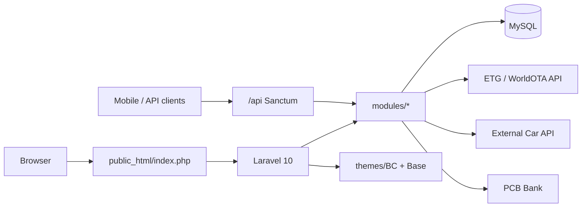

# Technical Documentation

Complete technical handbook for **Mjellma**, a customized Booking Core (Laravel) travel booking platform.

Use this index as the entry point after the repository [README](../README.md).

---

## Introduction

Mjellma is a PHP/Laravel booking application focused on:

- **Hotel search and booking** via Emerging Travel Group (ETG) / RateHawk / WorldOTA B2B API, backed by a local `hotels` catalog
- **Car rental** via an external HTTP car API
- Classic Booking Core bookable modules (tour, space, event, flight, boat)
- CMS, users, vendors, wallets, coupons, reviews, and admin tooling
- Payment processing with emphasis on **PCB Bank**, plus PayPal, Stripe, Payrexx, Paystack, and offline gateways
- A mobile-oriented JSON API under `/api` (Laravel Sanctum)

Application version string: `3.4.2` (`config/app.php`). Active frontend theme: **BC** (`config/bc.php`).

---

## Getting Started

- [Project Overview](./01-project-overview.md)
- [Technology Stack](./02-technology-stack.md)
- [Installation & Setup](./05-installation-and-setup.md)
- [Configuration](./06-configuration.md)
- [Environment Variables](./reference/environment-variables.md)

---

## Architecture

- [Project Architecture](./03-project-architecture.md)
- [Project Structure](./04-project-structure.md)
- [Database](./07-database.md)
- [Backend](./08-backend.md)
- [Frontend](./09-frontend.md)

---

## Application

- [Authentication & Authorization](./10-authentication-and-authorization.md)
- [API](./11-api.md)
- [Business Logic](./12-business-logic.md)
- [Features](./13-features.md)
- [Workflows](./14-workflows.md)
- [UI & Design System](./15-ui-and-design-system.md)
- [Localization](./16-localization.md)
- [Integrations](./17-integrations.md)

---

## Operations

- [Background Jobs & Automation](./18-background-jobs-and-automation.md)
- [Notifications & Emails](./19-notifications-and-emails.md)
- [Error Handling & Logging](./20-error-handling-and-logging.md)
- [Caching & Performance](./21-caching-and-performance.md)
- [Testing](./22-testing.md)
- [Build & Development Tools](./23-build-and-development-tools.md)
- [Deployment](./24-deployment.md)
- [Security](./25-security.md)
- [Troubleshooting](./26-troubleshooting.md)
- [Maintenance & Extension Guide](./27-maintenance-and-extension-guide.md)

---

## Reference

- [Routes](./reference/routes.md)
- [Models](./reference/models.md)
- [Controllers](./reference/controllers.md)
- [Services](./reference/services.md)
- [Components](./reference/components.md)
- [Database Tables](./reference/database-tables.md)
- [Environment Variables](./reference/environment-variables.md)
- [Important Files](./reference/important-files.md)

---

## Quick Architecture Summary

---

## Related Documentation

- Repository entry point: [../README.md](../README.md)
