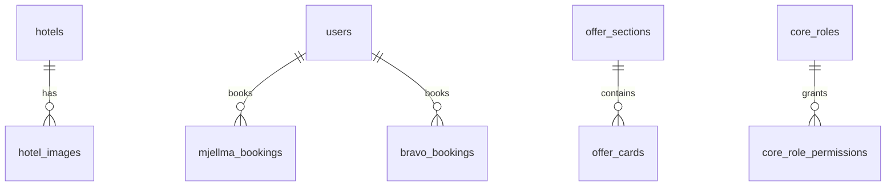

# Database Tables Reference

Important tables only. No sample personal data.

## hotels

| Item | Detail |
| --- | --- |
| Purpose | ETG static hotel catalog |
| PK | Typically `hotel_id` / id per dump schema |
| Model | `HotelH` |
| Source | Created/filled by `hotels_data.py` |
| Relations | has many `hotel_images` |

## hotel_images

| Item | Detail |
| --- | --- |
| Purpose | Images for static hotels |
| FK | `hotel_id` → hotels |
| Model | `HotelImage` |

## mjellma_bookings

| Item | Detail |
| --- | --- |
| Purpose | ETG hotel bookings |
| PK | `id` |
| Important columns | `order_id`, `partner_order_id`, `user_id`, contact fields, `payment_type`, `payment_amount`, `currency_code`, `pcb_status`, `api_status`, `api_error`, `pcb_bank_response`, `payment_successful`, agent/admin ids |
| Model | `MjellmaBooking` |
| Migration | `database/migrations/2025_04_23_105258_create_mjellma_bookings_table.php` (+ PCB alterations) |

## bravo_bookings

| Item | Detail |
| --- | --- |
| Purpose | Classic Booking Core bookings |
| Source | Base theme migrations + later alters (payment meta, PCB columns) |
| Relations | Users, services morph/meta |

## invoices

| Item | Detail |
| --- | --- |
| Purpose | Invoice records for payments |
| Migration | `database/migrations/2025_09_26_000000_create_invoices_table.php` |
| Service | `InvoiceService` |

## bravo_hotels (+ room tables)

Legacy/vendor hotel inventory and availability (`Hotel`, `HotelRoom`, `HotelRoomDate`, …).

## core_roles / core_role_permissions

Custom RBAC.

## users

Laravel users + Booking Core profile columns/meta.

## offer_sections / offer_cards

Offers CMS.

## personal_access_tokens

Sanctum API tokens.

## Other bravo_* domains

Tours, cars, spaces, events, flights, boats, locations, reviews, coupons, news, etc., from module/theme migrations.

## ER Snapshot

## Related Documentation

- [Database](../07-database.md)
- [Models](./models.md)
